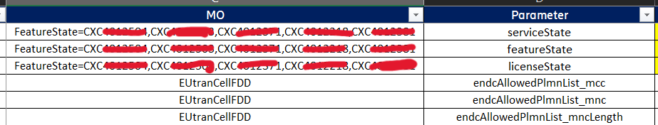

Ranterstellar is a command-line tool for easily access RAN data. Current functionality support auditing and collecting configurations.

---
## Table of Contents

- [Table of Contents](#table-of-contents)
- [1. Installation](#1-installation)
- [2. Terminology](#2-terminology)
- [3. Audit Configurations `audit-cm`](#3-audit-configurations-audit-cm)
  - [3.1 Overview](#31-overview)
  - [3.2 Options](#32-options)
  - [3.3 Sample Usage](#33-sample-usage)
  - [3.4 RAN Object File](#34-ran-object-file)
  - [3.5 Reference File](#35-reference-file)
    - [3.5.1 Header Structure](#351-header-structure)
    - [3.5.2 Parameter Indicator \& Group Parameter](#352-parameter-indicator--group-parameter)
    - [3.5.3 MO \& Parameter](#353-mo--parameter)
    - [3.5.4 Dependency \& Band Rules](#354-dependency--band-rules)
  - [3.6 Config JSON File](#36-config-json-file)
  - [3.7 Output Report Type](#37-output-report-type)
    - [3.7.1 Simple Summary](#371-simple-summary)
    - [3.7.2 Verbose Report](#372-verbose-report)
- [4. Collect Configuration `get-cm`](#4-collect-configuration-get-cm)

---

## 1. Installation

Download the tar.gz file. Then run:
```
cd [tar.gz-location]
pip install ranterstellar-0.1.1.tar.gz
```
---

## 2. Terminology

- **RAN Objects** : entities in radio access network (e.g site, node, cell)
- **RAN Objects List File** : excel file containing RAN objects list of your interest. [More on RAN Objects List File](#35-ran-object-file).
- **Reference File** : excel file containing MO and Parameter rules to be checked. Guideline to create the file is [here](#34-reference-file).
- **Configuration file**: JSON file containing configuration parameter to use when running the command. Default global configuration file is already set when installing the package. To create custom configuration file check [here](#36-config-file).
- **mo-id**: subclass identifier in each MO. usually define as mo+id. e.g `eutrancellfddid`, `eutranfreqrelationid`, `featurestateid`, `qciprofilepredefinedid`.
- **sub-id**: unique identifier inside `mo-id` of each MO. For example in mo-id `qciprofilepredefinedid` has sub-id like `qci1`, `qci2`, etc.

---

## 3. Audit Configurations `audit-cm`

### 3.1 Overview

The `audit-cm` command allows users to audit configurations based on a **reference file** for all objects defined in a **ran object list file**.

### 3.2 Options

| Option | Type | Description |
| -------- | -------- | -------- |
| `--object-list` | String | Path to RAN Object List file you want to use as filter. If empty all cell in all enm will be evaluated.|
| `--reference` | String | Path to Reference File to use as a checking guide. (mandatory) |
| `--config` | String | Path to configuration file to use in the running instance.|
| `--date` | String | CM date you want to evaluate. Use format **'YYYYMMDD'**. If empty will be set to today's date |
| `--filter-by` | String ( `'node'` , `'site'` , `'ne'`,`'cell'`  ) | Types of filter you want to use; node, site or cell. Default value set to `'node'`. Make sure the column in `--object-list` not empty for choosen value, except for `site`. |
| `--cm-folder` | String | Path to folder to look for CM files. Default value set in the configuration file. |
| `--cm-subfolder` | List | List of sub-folders to look for CM files in `--cm-folder`. Default value set in the configuration file. If empty, command will only look for CM files in the `--cm-folder`. |
| `--verbose` | Bool ( `True`, `False` ) | Choose generate simple summary or verbose report. Default `False` |
| `--output` | String | Filename for the output file. Only support **.xlsx** extension. Use absolute path to specify output location. If no path will be placed on working directory  |
| `--preprocess` | Bool ( `True`, `False` ) | Run preprocess or not. Default `True`. Recommend to run preprocess at lease once for a certain date |


### 3.3 Sample Usage
- Use `--help` to show command options and description
```
ranterstellar audit-cm --help
```

- Run audit for `node` in `anchor5G.xslx` with reference in `5g_anchor_reference`, outputing a verbose report with name `test_anchor.xlsx` in the current working directory.
```bash
ranterstellar audit-cm --object-list="/path/to/cell/list/file/anchor5G.xlsx" --reference="/path/to/reference/file/5g_anchor_reference.xlsx" --date="20231003" --output-folder="./test_anchor.xlsx" --preprocess=False --verbose=True
```

### 3.4 RAN Object File
  Excel file containing RAN objects list of your interest.
  
  For `audit-cm ` function this file should contain at least one of the header specify for `filter-by` : `mecontext, cell, dlChannelBandwidth`.

  | filter-by | object-list column |
| -------- | -------- |
| `node` | mecontext 
| `site` | siteid
| `ne` | ne 
| `cell` | cell
  
  *mecontext* is for the node list, and *cell* for the cell list. You could only fill one of them and leave the other blank but the header needs to be specify. If you want to filter by Site ID, you could add additional *siteid* column but its not mandatory. You could still filter by Site ID using the `--filter-by` option.
  
  >Note: that whatever object option you choose for filter, value for that object column in the object list file must not empty.

  

### 3.5 Reference File

#### 3.5.1 Header Structure

Reference file header consist mainly of 4 parts:

1. Grouping Part : `Parameter Indicator` and `Group Parameter`
  These header specify level 1 and level 2 grouping respectively for each parameter.
  These grouping will be used in the [Verbose Report](#362-verbose-report). If not specify `Default Indicator` and `Default Group` will be used instead.
2. Parameter Identifier Part : `MO` and `Parameter`
  This part specify which configuration need to be evaluated.
3. Rule Part: `Dependency` and `Band`
  This part define the rule for configuration evaluation. The rule is define for each band, hence each band should have a single independent column.
  A configuration rule often times could depend on another config value. 
4. Complementary Part: `Action`, `Remark`, and `Rules`
  This part act as additional info for the [Verbose Report](#362-verbose-report). Whatever written on those column will be displayed on the verbose report summary. It is recommended to write info in corresponding column. Action info in `Action` column, additional notes in `Remark`, and description of audit rules in `Rules`. However, `Action` column have a special trait in which if you put `as info` as the value, whatever the configuration will be evaluated as OK even if no value exist.

#### 3.5.2 Parameter Indicator & Group Parameter
Example of Parameter Indicator and Group Parameter


In [Verbose Report](#362-verbose-report), the `Parameter Indicator` will split the config into different sheets


`Group Parameter` will split the config in the same Indicator or sheet to group of columns.


#### 3.5.3 MO & Parameter

`MO` and `Parameter` name should follow the existing data and case sensitive.

You could write MO in several ways:
   - **As is**. 
      MO could be written as the name suggest. (e.g. `EUtranCellFDD`, `UePolicyOptimization`, `Lm`, etc) In this format MO, all sub-id in the mo-id will be evaluated individually except for `EUtranCellFDD`, `EUtranCellTDD`, and `NRCellDU`. MO with no significant sub-id like `ReportConfigA5UlTraffic` or `CarrierAggregationFunction` will be evaluated normally. On the other side, MO that heavily linked with its sub-id like `FeatureState`, `QciProfilePredefined`, `EUtranFreqRelation` and other ASGH MO will be evaluated for each of all sub-id.
   - **Single Sub-Id**
      On contrary to evaluate all the sub-id, only a single certain sub-id could be evoked by adding `={sub-id}` after the MO. e.g. `QciProfileOperatorDefined=qci128`, `EUtranFreqRelation=L2100`.
   - **Multiple Sub-Id**
      To select multiple sub-id within certain mo, list all the sub-id after the `=` with `,`(comma). e.g. `FeatureState=CXC4012504,CXC4012503,CXC4012371`, `QciProfilePredefined=qci1,qci2,qci3`.

Parameter can only be written as it is.

>Notes: struct-type parameter may be divided into several parameter with the param and struct item joint by "_" (underscore) e.g. in MO like `endcAllowedPlmnList_mcc`,`endcAllowedPlmnList_mnc`, and `endcAllowedPlmnList_mncLength`



#### 3.5.4 Dependency & Band Rules

Dependency and Band Rules are tightly corellated. The exact rules for the audit located at each Band column. The frequency bands currently supported in this version are `L900`, `L1800`, `L2100`, `L2300_10` and `L2300_20`. Band with no column name specify in the Reference File will be evaluated as NA. If `Dependency` is specified, the audit will consider the parameter value of the dependent MO for each band and will not otherwise.

Dependency only contain the dependent MO name and parameter with `MO.parameter` format and can be declared in a few ways:
  
   - **Single Dependency for All Bands**
      Simply state the MO.parameter e.g. `EUtranCellFDD.crsgain`
   - **Single Dependency for Different Bands**
      To use different dependency for each bands. use dictionary like format `{}` with the dependent mo.param as key and list `[]` of bands as the value.
      e.g. `{EUtranCellFDD.dlchannelbandwidth:[L900,L1800,L2100],EUtranCellTDD.channelbandwidth:[L2300_10,L2300_20]}`
      This means `L900`, `L1800`, and `L2100` will depend on `EUtranCellFDD.dlchannelbandwidth` parameter and so on.
   - **Multiple Dependency**
      Currentlly not supported.

A Rule can be defined by:
- `single value` or equivalent with logical operator `equal to`. 
  Use `=` operator as a single value rule to say that the parameter evaluated must have the same value as the dependent parameter.
  Use `*` as a single value rule to say that all value of the parameter evaluated are OK.
- `logical value`. Logical value rules consist of a logical operator and a single value. Logical operator available are:
  * `>` greater than
  * `>=` grater than or equal to
  * `<` less than
  * `<=` less than or equal to
  * `!=` not equal to

Rules in certain band column, follow a pattern of 2 types:
   - **Independent Rule**
      Only a single rule defined.The rule can be single-valued or logical.
   - **Conditional Rule**
      Conditional rule format defined by creating clauses with `dependentRule:Rule` format and separating each clause with `;`. 
      e.g `dependentRule1:Rule1;dependentRule2:Rule2`. This means that if the value of dependent parameter fulfill the `dependentRule1`, then the parameter evaluated must follow `Rule1` and if the value of dependent parameter fulfill the `dependentRule2`, then the parameter evaluated must follow `Rule2`.

Example


### 3.6 Config JSON File

Default config.json file. Change the value to suit your system. Add your EARFCN if not listed, otherwise it will not be recognized.

```{
    "reference_location" : "/var/opt/so/data/concheck/reference_files",
    "cells_location"     : "/var/opt/so/data/cell_list",
    "cm_folder"          : "/var/opt/so/data/decoded_cm",
    "output_folder"      : "/var/opt/so/data/concheck/result.xlsx",

    "bands" : ["L900","L1800","L2100","L2300_10","L2300_20"],

    "enm_list" : ["enm7", "enm8", "enm9", "enm11"],

    "earfcn_map" : {
        "1850"   : "L1800",
        "3500"   : "L900",
        "38750"  : "L2300_20",
        "38894"  : "L2300_20",
        "38948"  : "L2300_20",
        "39092"  : "L2300_10",
        "250"    : "L2100",
        "500"    : "L2100",
        "464000" : "N40",
        "463000" : "N40",
        "432000" : "N1",
        "426500" : "N1"
    }
}
```

### 3.7 Output Report Type

Report output type is defined by the `--verbose` flag. By default it is set to `False` which will generate Simple Summary Report. If set to `True` it will generate a detailed Verbose Report.

#### 3.7.1 Simple Summary

Simple summary output list all MO and parameter vertically in a single sheet. Useful for quick sorting of OK/NOK status of certain parameters and for pivoting.


#### 3.7.2 Verbose Report

Verbose Report will give detail parameter check for each `Parameter Indicato` and `Group Parameter` defined in `Reference File`. It will also create summary number of audit status OK/NOK for all parameters excluding Cell Relation MO. Cell Relation MO will be displayed in a single sheet as it is.

**Summary Page**


**Detail Audit Page**
Each `Group Parameter` in a sheet will be coded with a single color and checked overall at the end.


---


## 4. Collect Configuration `get-cm`


---
